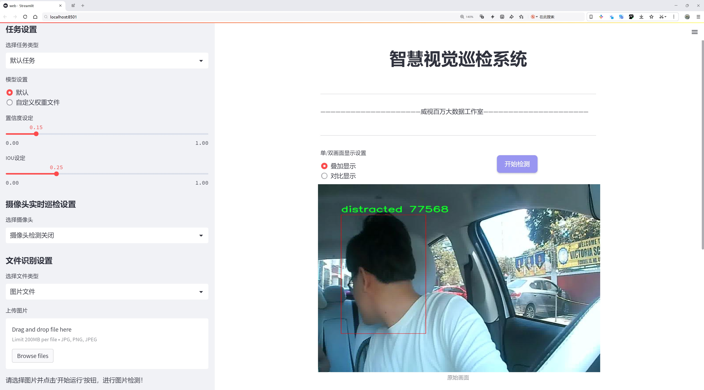
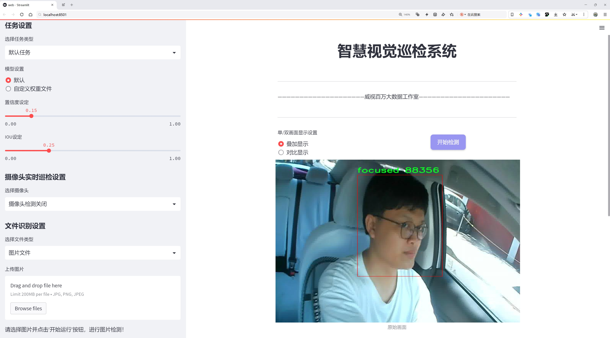
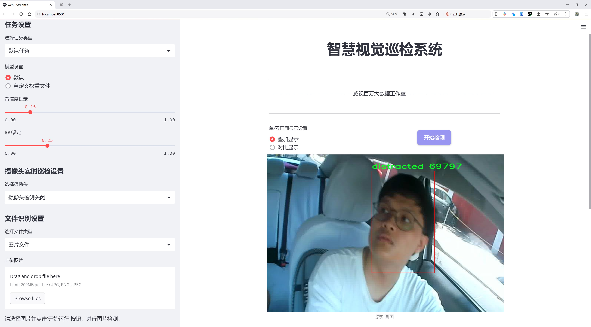
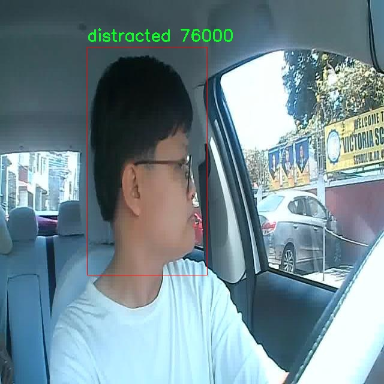
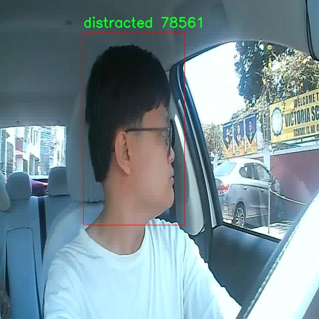
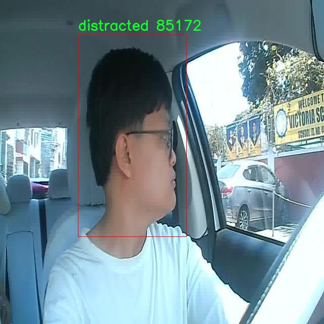
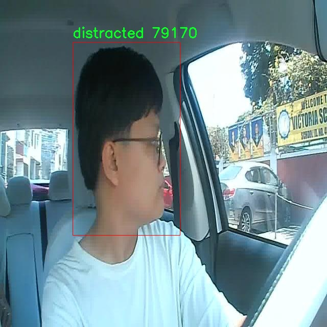

# 驾驶员注意力分神状态检测检测系统源码分享
 # [一条龙教学YOLOV8标注好的数据集一键训练_70+全套改进创新点发刊_Web前端展示]

### 1.研究背景与意义

项目参考[AAAI Association for the Advancement of Artificial Intelligence](https://gitee.com/qunshansj/projects)

项目来源[AACV Association for the Advancement of Computer Vision](https://gitee.com/qunmasj/projects)

研究背景与意义

随着智能交通系统和自动驾驶技术的快速发展，驾驶员的安全性和注意力状态逐渐成为研究的重点。驾驶员的注意力分神不仅会导致交通事故的增加，还会对道路安全造成严重威胁。根据相关统计数据，因驾驶员注意力不集中而导致的交通事故占总事故的相当大比例，这一现象引起了社会各界的广泛关注。因此，开发一种高效、准确的驾驶员注意力分神状态检测系统显得尤为重要。

近年来，深度学习技术的迅猛发展为图像识别和目标检测提供了新的解决方案。其中，YOLO（You Only Look Once）系列模型因其高效的实时检测能力而被广泛应用于各种视觉任务。YOLOv8作为该系列的最新版本，进一步提升了检测精度和速度，成为研究者们关注的焦点。然而，现有的YOLOv8模型在特定应用场景下，如驾驶员注意力状态检测，仍存在一定的局限性。为了提升其在此领域的应用效果，有必要对YOLOv8进行改进，以更好地适应驾驶员面部特征的检测和状态判断。

本研究将基于改进的YOLOv8模型，构建一个驾驶员注意力分神状态检测系统。该系统将利用一个包含3400张图像的数据集，数据集中分为“分心”和“专注”两类，旨在通过对驾驶员面部特征的实时分析，准确判断其注意力状态。数据集的丰富性和多样性为模型的训练提供了良好的基础，使得系统能够在不同环境和条件下进行有效的状态检测。此外，结合深度学习的特征提取能力，系统将能够自动识别出驾驶员在驾驶过程中的微小表情变化，从而实现对注意力状态的精准判断。

本研究的意义不仅在于技术层面的创新，更在于其对交通安全的积极影响。通过实时监测驾驶员的注意力状态，系统能够及时发出警示，帮助驾驶员重新集中注意力，从而有效降低交通事故的发生率。此外，该系统的应用还可以为未来的智能驾驶技术提供重要的数据支持和技术参考，推动自动驾驶系统在安全性和可靠性方面的进一步发展。

综上所述，基于改进YOLOv8的驾驶员注意力分神状态检测系统的研究，不仅具有重要的学术价值，也为实际交通安全管理提供了切实可行的解决方案。通过深入探讨和实现这一系统，期望能够为提升驾驶安全性、减少交通事故提供新的思路和方法，进而推动智能交通领域的持续发展。

### 2.图片演示







##### 注意：由于此博客编辑较早，上面“2.图片演示”和“3.视频演示”展示的系统图片或者视频可能为老版本，新版本在老版本的基础上升级如下：（实际效果以升级的新版本为准）

  （1）适配了YOLOV8的“目标检测”模型和“实例分割”模型，通过加载相应的权重（.pt）文件即可自适应加载模型。

  （2）支持“图片识别”、“视频识别”、“摄像头实时识别”三种识别模式。

  （3）支持“图片识别”、“视频识别”、“摄像头实时识别”三种识别结果保存导出，解决手动导出（容易卡顿出现爆内存）存在的问题，识别完自动保存结果并导出到tempDir中。

  （4）支持Web前端系统中的标题、背景图等自定义修改，后面提供修改教程。

  另外本项目提供训练的数据集和训练教程,暂不提供权重文件（best.pt）,需要您按照教程进行训练后实现图片演示和Web前端界面演示的效果。

### 3.视频演示

[3.1 视频演示](https://www.bilibili.com/video/BV1nb4UeaEY7/)

### 4.数据集信息展示

##### 4.1 本项目数据集详细数据（类别数＆类别名）

nc: 2
names: ['distracted', 'focused']


##### 4.2 本项目数据集信息介绍

数据集信息展示

在本研究中，我们使用了名为“Driver Face Detection”的数据集，以支持对驾驶员注意力分神状态的检测系统的训练与改进。该数据集专门设计用于识别和分类驾驶员在驾驶过程中的注意力状态，旨在提升自动驾驶和驾驶辅助系统的安全性和可靠性。数据集的类别数量为2，具体类别包括“distracted”（分心）和“focused”（专注）。这两个类别的设定不仅反映了驾驶员在驾驶时的两种主要状态，也为后续的模型训练提供了清晰的目标。

“Driver Face Detection”数据集包含大量的图像样本，这些样本通过多种方式捕捉到驾驶员在不同环境和情境下的面部表情与姿态。数据集中的图像涵盖了各种驾驶场景，包括城市道路、高速公路、夜间驾驶以及不同天气条件下的驾驶。这种多样性确保了模型在训练过程中能够学习到更为丰富的特征，从而提高其在实际应用中的泛化能力。数据集中每个类别的样本均经过精心标注，确保了数据的准确性和可靠性，为后续的深度学习模型提供了坚实的基础。

在“distracted”类别中，样本主要包括驾驶员在进行非驾驶相关活动时的面部图像，例如使用手机、与乘客交谈或注视车外景物等。这些图像的捕捉不仅展示了驾驶员的面部特征，还反映了他们的注意力分散程度。相对而言，“focused”类别则包含了驾驶员在专注于驾驶时的图像，这些图像展示了他们在驾驶过程中的自然表情和姿态。通过对这两类样本的对比分析，模型能够有效地学习到分心与专注状态之间的显著差异。

在数据集的构建过程中，研究团队还考虑到了样本的多样性和代表性，以确保模型在不同驾驶环境和人群中的适用性。数据集中的样本不仅涵盖了不同性别、年龄和种族的驾驶员，还考虑到了不同的车辆类型和驾驶习惯。这种多样性使得模型在面对现实世界中的复杂情况时，能够更好地进行状态判断，从而提高驾驶安全性。

此外，为了进一步增强模型的鲁棒性，数据集还包含了一些经过数据增强处理的样本。这些增强技术包括图像旋转、缩放、颜色调整等，旨在模拟不同的视觉条件和驾驶场景。这些处理使得模型在训练过程中能够接触到更多的变异情况，从而提高其对新环境的适应能力。

总之，“Driver Face Detection”数据集为改进YOLOv8的驾驶员注意力分神状态检测系统提供了丰富而多样的训练数据。通过对“distracted”和“focused”两种状态的深入分析与学习，研究团队期望能够开发出更为精准和高效的驾驶员状态检测模型，为未来的智能驾驶技术奠定坚实的基础。










### 5.全套项目环境部署视频教程（零基础手把手教学）

[5.1 环境部署教程链接（零基础手把手教学）](https://www.ixigua.com/7404473917358506534?logTag=c807d0cbc21c0ef59de5)


[5.2 安装Python虚拟环境创建和依赖库安装视频教程链接（零基础手把手教学）](https://www.ixigua.com/7404474678003106304?logTag=1f1041108cd1f708b01a)

### 6.手把手YOLOV8训练视频教程（零基础小白有手就能学会）

[6.1 手把手YOLOV8训练视频教程（零基础小白有手就能学会）](https://www.ixigua.com/7404477157818401292?logTag=d31a2dfd1983c9668658)

### 7.70+种全套YOLOV8创新点代码加载调参视频教程（一键加载写好的改进模型的配置文件）

[7.1 70+种全套YOLOV8创新点代码加载调参视频教程（一键加载写好的改进模型的配置文件）](https://www.ixigua.com/7404478314661806627?logTag=29066f8288e3f4eea3a4)

### 8.70+种全套YOLOV8创新点原理讲解（非科班也可以轻松写刊发刊，V10版本正在科研待更新）

由于篇幅限制，每个创新点的具体原理讲解就不一一展开，具体见下列网址中的创新点对应子项目的技术原理博客网址【Blog】：


[8.1 70+种全套YOLOV8创新点原理讲解链接](https://gitee.com/qunmasj/good)

### 9.系统功能展示（检测对象为举例，实际内容以本项目数据集为准）

图9.1.系统支持检测结果表格显示

  图9.2.系统支持置信度和IOU阈值手动调节

  图9.3.系统支持自定义加载权重文件best.pt(需要你通过步骤5中训练获得)

  图9.4.系统支持摄像头实时识别

  图9.5.系统支持图片识别

  图9.6.系统支持视频识别

  图9.7.系统支持识别结果文件自动保存

  图9.8.系统支持Excel导出检测结果数据


### 10.原始YOLOV8算法原理

原始YOLOv8算法原理

YOLOv8作为YOLO系列的最新版本，承载着多年来目标检测领域的技术积累与创新。自2015年YOLOv1问世以来，YOLO模型经历了多个版本的迭代，每一次更新都在推理速度、检测精度、训练便利性和硬件兼容性等方面取得了显著的进步。YOLOv8不仅在这些方面表现出色，还引入了一些新的理念和技术，使其成为当前业界最受欢迎的目标检测算法之一。

YOLOv8的网络结构由三个主要部分组成：Backbone（主干网络）、Neck（颈部结构）和Head（头部结构）。在Backbone部分，YOLOv8采用了CSP（Cross Stage Partial）结构，这种设计使得网络能够有效地提取图像特征，同时保持较低的计算复杂度。CSP结构通过分割特征图并在不同阶段进行特征融合，提升了模型的梯度流动性，从而增强了网络的学习能力。

在Neck部分，YOLOv8引入了PAN-FPN（Path Aggregation Network - Feature Pyramid Network）结构，这一创新旨在更好地融合来自不同尺度的特征图。通过有效地整合多层次的特征信息，PAN-FPN能够帮助模型在处理不同大小的目标时，保持较高的检测精度。该结构通过自下而上的路径聚合特征，使得高层语义信息与低层细节信息得以有效结合，从而提升了目标检测的性能。

YOLOv8的Head部分则是其最具创新性的地方。与之前版本的耦合头不同，YOLOv8采用了解耦头结构，将目标检测任务中的分类和回归过程分开处理。这种设计使得模型在处理复杂场景时，能够更专注于各自的任务，减少了因任务耦合导致的错误。这一解耦设计不仅提高了模型的检测精度，还加快了训练速度，提升了整体性能。

在目标检测方法上，YOLOv8采用了Anchor-free的策略，摒弃了传统方法中对锚框的依赖。传统的目标检测方法通常需要预定义锚框，这不仅增加了模型设计的复杂性，还可能导致在不同尺度和形状目标上的适应性不足。而YOLOv8通过直接回归目标的位置和大小，使得网络能够更快地聚焦于目标的实际位置。这种方法的优势在于，它能够更灵活地适应各种目标的特征，从而提高了检测的准确性和效率。

YOLOv8的训练过程也得到了优化，模型的深度、宽度和通道数等参数可以通过depth_factor、width_factor和ratio进行灵活调整。这种灵活性使得用户能够根据具体的应用场景和硬件条件，快速调整模型的结构，以达到最佳的性能表现。YOLOv8的权重文件经过进一步轻量化处理，使得其能够在嵌入式设备上高效运行，满足实时检测的需求。

在实际应用中，YOLOv8首先会对输入图像进行缩放，以适应指定的输入尺寸。接着，主干网络通过卷积操作对图像进行下采样，提取出丰富的特征信息。每个卷积层都配备了批归一化和SiLU激活函数，这不仅提高了模型的收敛速度，还增强了其非线性表达能力。主干网络的最后部分使用了SPP（Spatial Pyramid Pooling）结构，通过多个最大池化层处理多尺度特征，进一步提升了网络的特征抽象能力。

在特征融合的过程中，Neck部分利用FPNS和PAN结构，将不同尺度的特征图信息进行有效整合，并将处理后的特征传递给Head部分。最后，解耦的检测头通过两个并行的卷积分支，分别计算回归和分类的损失，从而实现高效的目标检测。

综上所述，YOLOv8不仅继承了YOLO系列的优良传统，还在多个方面进行了创新和优化。其独特的网络结构设计、灵活的模型参数设置以及高效的Anchor-free目标检测方法，使得YOLOv8在目标检测领域中脱颖而出，成为了当前最具竞争力的解决方案之一。随着YOLOv8的不断发展与应用，未来的目标检测技术将更加高效、精准，推动各行各业的智能化进程。


### 11.项目核心源码讲解（再也不用担心看不懂代码逻辑）

#### 11.1 code\train.py

以下是经过精简和注释的核心代码部分：

```python
import os
import torch
import yaml
from ultralytics import YOLO  # 导入YOLO模型
from QtFusion.path import abs_path  # 导入获取绝对路径的函数

# 设置设备为GPU（如果可用），否则使用CPU
device = "0" if torch.cuda.is_available() else "cpu"

if __name__ == '__main__':  # 确保该模块被直接运行时才执行以下代码
    workers = 1  # 设置数据加载的工作进程数
    batch = 2    # 设置每个批次的大小

    data_name = "data"  # 数据集名称
    # 获取数据集配置文件的绝对路径
    data_path = abs_path(f'datasets/{data_name}/{data_name}.yaml', path_type='current')  
    unix_style_path = data_path.replace(os.sep, '/')  # 将路径转换为Unix风格

    # 获取数据集目录路径
    directory_path = os.path.dirname(unix_style_path)
    
    # 读取YAML文件，保持原有顺序
    with open(data_path, 'r') as file:
        data = yaml.load(file, Loader=yaml.FullLoader)
    
    # 修改YAML文件中的路径项
    if 'path' in data:
        data['path'] = directory_path  # 更新路径为数据集目录
        # 将修改后的数据写回YAML文件
        with open(data_path, 'w') as file:
            yaml.safe_dump(data, file, sort_keys=False)

    # 加载预训练的YOLOv8模型
    model = YOLO(model='./ultralytics/cfg/models/v8/yolov8s.yaml', task='detect')  
    
    # 开始训练模型
    results2 = model.train(
        data=data_path,  # 指定训练数据的配置文件路径
        device=device,  # 使用指定的设备进行训练
        workers=workers,  # 使用的工作进程数
        imgsz=640,  # 输入图像的大小
        epochs=100,  # 训练的epoch数量
        batch=batch,  # 每个批次的大小
        name='train_v8_' + data_name  # 训练任务的名称
    )
```

### 代码说明：
1. **导入模块**：导入必要的库，包括`os`、`torch`、`yaml`和YOLO模型。
2. **设备选择**：根据是否有可用的GPU选择训练设备。
3. **数据集路径处理**：
   - 设置数据集名称并获取其配置文件的绝对路径。
   - 将路径转换为Unix风格以确保兼容性。
   - 读取YAML文件并更新其中的路径项。
4. **模型加载与训练**：
   - 加载YOLOv8模型的配置。
   - 调用`train`方法开始训练，传入必要的参数如数据路径、设备、工作进程数、图像大小、训练轮数和批次大小。

该程序文件 `train.py` 是一个用于训练 YOLOv8 模型的脚本。首先，它导入了必要的库，包括 `os`、`torch`、`yaml` 和 `ultralytics` 中的 YOLO 模型。接着，它根据当前环境检查是否可以使用 GPU，如果可以，则将设备设置为 "0"（表示第一个 GPU），否则使用 CPU。

在 `__main__` 块中，程序首先定义了一些训练参数，包括工作进程数量（`workers`）和批次大小（`batch`）。然后，程序指定了数据集的名称，这里使用的是 "data"，并构建了数据集 YAML 文件的绝对路径。接下来，通过 `abs_path` 函数获取该路径，并将其转换为 UNIX 风格的路径，以确保在不同操作系统上都能正确处理。

程序随后获取了数据集目录的路径，并打开指定的 YAML 文件以读取数据。读取后，如果 YAML 文件中包含 `path` 项，则将其修改为数据集的目录路径，并将更新后的数据写回 YAML 文件。这一步确保了数据集路径的正确性，以便后续训练时能够找到数据。

接下来，程序加载了预训练的 YOLOv8 模型，指定了模型的配置文件路径。然后，它调用 `model.train()` 方法开始训练模型。在训练过程中，程序传入了一系列参数，包括数据配置文件路径、设备选择、工作进程数量、输入图像大小（640x640）、训练的 epoch 数量（100）以及批次大小（2）。最后，训练任务的名称也被指定为 `train_v8_` 加上数据集名称，以便于后续的管理和识别。

总的来说，这个脚本的主要功能是配置并启动 YOLOv8 模型的训练过程，确保数据集路径正确，并设置合适的训练参数。

#### 11.2 ui.py

```python
import sys
import subprocess

def run_script(script_path):
    """
    使用当前 Python 环境运行指定的脚本。

    Args:
        script_path (str): 要运行的脚本路径

    Returns:
        None
    """
    # 获取当前 Python 解释器的路径
    python_path = sys.executable

    # 构建运行命令，使用 streamlit 运行指定的脚本
    command = f'"{python_path}" -m streamlit run "{script_path}"'

    # 执行命令
    result = subprocess.run(command, shell=True)
    # 检查命令执行结果，如果返回码不为0，表示出错
    if result.returncode != 0:
        print("脚本运行出错。")


# 主程序入口
if __name__ == "__main__":
    # 指定要运行的脚本路径
    script_path = "web.py"  # 这里可以直接指定脚本路径

    # 调用函数运行脚本
    run_script(script_path)
```

### 代码注释说明：

1. **导入模块**：
   - `sys`：用于访问与 Python 解释器紧密相关的变量和函数。
   - `subprocess`：用于执行外部命令和与其交互。

2. **定义 `run_script` 函数**：
   - 该函数接受一个参数 `script_path`，表示要运行的 Python 脚本的路径。
   - 函数内部首先获取当前 Python 解释器的路径，然后构建一个命令字符串，使用 `streamlit` 运行指定的脚本。

3. **执行命令**：
   - 使用 `subprocess.run` 执行构建的命令，并通过 `shell=True` 允许在 shell 中执行。
   - 检查命令的返回码，如果返回码不为0，表示脚本运行出错，打印错误信息。

4. **主程序入口**：
   - 通过 `if __name__ == "__main__":` 确保该部分代码仅在直接运行该脚本时执行。
   - 指定要运行的脚本路径为 `web.py`，然后调用 `run_script` 函数来执行该脚本。

这个程序文件的主要功能是使用当前的 Python 环境来运行一个指定的脚本，具体是一个名为 `web.py` 的文件。程序首先导入了必要的模块，包括 `sys`、`os` 和 `subprocess`，以及一个自定义的 `abs_path` 函数，用于获取文件的绝对路径。

在 `run_script` 函数中，首先获取当前 Python 解释器的路径，这通过 `sys.executable` 实现。接着，构建一个命令字符串，这个命令使用 `streamlit` 来运行指定的脚本。`streamlit` 是一个用于构建数据应用的框架，因此这个程序的目的是启动一个基于 `streamlit` 的 web 应用。

然后，使用 `subprocess.run` 来执行这个命令。`shell=True` 参数允许在 shell 中执行命令。函数会检查命令的返回码，如果返回码不为零，表示脚本运行出错，程序会打印出错误信息。

在文件的最后部分，使用 `if __name__ == "__main__":` 语句来确保只有在直接运行该文件时才会执行下面的代码。这里指定了要运行的脚本路径，调用 `abs_path` 函数获取 `web.py` 的绝对路径，并最终调用 `run_script` 函数来执行这个脚本。

总体来说，这个程序是一个简单的启动器，用于在当前 Python 环境中运行一个 `streamlit` 应用，便于开发和测试。

#### 11.3 code\ultralytics\models\yolo\segment\train.py

以下是代码中最核心的部分，并附上详细的中文注释：

```python
from ultralytics.models import yolo
from ultralytics.nn.tasks import SegmentationModel
from ultralytics.utils import DEFAULT_CFG, RANK
from ultralytics.utils.plotting import plot_images, plot_results

class SegmentationTrainer(yolo.detect.DetectionTrainer):
    """
    SegmentationTrainer类，扩展了DetectionTrainer类，用于基于分割模型的训练。
    """

    def __init__(self, cfg=DEFAULT_CFG, overrides=None, _callbacks=None):
        """初始化SegmentationTrainer对象，使用给定的参数。"""
        if overrides is None:
            overrides = {}
        overrides["task"] = "segment"  # 设置任务类型为分割
        super().__init__(cfg, overrides, _callbacks)  # 调用父类的初始化方法

    def get_model(self, cfg=None, weights=None, verbose=True):
        """返回根据指定配置和权重初始化的SegmentationModel模型。"""
        # 创建SegmentationModel实例，ch=3表示输入通道数为3（RGB），nc为类别数
        model = SegmentationModel(cfg, ch=3, nc=self.data["nc"], verbose=verbose and RANK == -1)
        if weights:
            model.load(weights)  # 如果提供了权重，则加载权重

        return model  # 返回模型实例

    def get_validator(self):
        """返回SegmentationValidator实例，用于YOLO模型的验证。"""
        self.loss_names = "box_loss", "seg_loss", "cls_loss", "dfl_loss"  # 定义损失名称
        return yolo.segment.SegmentationValidator(
            self.test_loader, save_dir=self.save_dir, args=copy(self.args), _callbacks=self.callbacks
        )  # 返回验证器实例

    def plot_training_samples(self, batch, ni):
        """创建训练样本图像的绘图，包括标签和框坐标。"""
        plot_images(
            batch["img"],  # 图像数据
            batch["batch_idx"],  # 批次索引
            batch["cls"].squeeze(-1),  # 类别标签
            batch["bboxes"],  # 边界框
            masks=batch["masks"],  # 分割掩码
            paths=batch["im_file"],  # 图像文件路径
            fname=self.save_dir / f"train_batch{ni}.jpg",  # 保存文件名
            on_plot=self.on_plot,  # 绘图回调
        )

    def plot_metrics(self):
        """绘制训练和验证指标。"""
        plot_results(file=self.csv, segment=True, on_plot=self.on_plot)  # 保存结果为results.png
```

### 代码核心部分说明：
1. **SegmentationTrainer类**：这是一个用于训练分割模型的类，继承自YOLO的检测训练器类。
2. **初始化方法**：设置任务类型为分割，并调用父类的初始化方法。
3. **get_model方法**：创建并返回一个分割模型实例，可以加载预训练权重。
4. **get_validator方法**：返回一个验证器实例，用于评估模型性能。
5. **plot_training_samples方法**：绘制训练样本的图像，包含标签和边界框信息。
6. **plot_metrics方法**：绘制训练和验证过程中的指标，帮助分析模型性能。

这个程序文件定义了一个用于训练YOLO分割模型的类`SegmentationTrainer`，它继承自`DetectionTrainer`类。文件开头包含了相关的导入语句，导入了YOLO模型、分割模型、默认配置、排名信息以及绘图工具。

在`SegmentationTrainer`类中，构造函数`__init__`初始化了一个分割训练器对象。它接受配置参数`cfg`、覆盖参数`overrides`和回调函数`_callbacks`。如果没有提供覆盖参数，默认会创建一个空字典，并将任务类型设置为“segment”。然后，它调用父类的构造函数进行初始化。

`get_model`方法用于返回一个初始化的分割模型`SegmentationModel`，该模型根据提供的配置和权重进行初始化。如果提供了权重，它会加载这些权重。该方法还可以控制是否在初始化时输出详细信息。

`get_validator`方法返回一个`SegmentationValidator`实例，用于对YOLO模型进行验证。在这个方法中，定义了损失名称，包括框损失、分割损失、分类损失和DFL损失。然后创建并返回一个分割验证器对象。

`plot_training_samples`方法用于生成训练样本图像的绘图，显示图像、标签和框坐标。它使用`plot_images`函数将图像及其相关信息绘制到一个文件中，文件名根据批次索引命名。

最后，`plot_metrics`方法用于绘制训练和验证的指标。它调用`plot_results`函数，传入CSV文件路径和其他参数，以生成包含结果的图像。

整体来看，这个文件提供了一个结构化的方式来训练YOLO分割模型，并包括了模型的初始化、验证和可视化等功能。

#### 11.4 code\ultralytics\models\rtdetr\__init__.py

以下是代码中最核心的部分，并附上详细的中文注释：

```python
# 导入必要的模块和类
from .model import RTDETR  # 从当前包中导入 RTDETR 模型类
from .predict import RTDETRPredictor  # 从当前包中导入 RTDETR 预测器类
from .val import RTDETRValidator  # 从当前包中导入 RTDETR 验证器类

# 定义模块的公开接口
__all__ = "RTDETRPredictor", "RTDETRValidator", "RTDETR"  # 指定可以被外部访问的类
```

### 详细注释说明：
1. **导入模块**：
   - `from .model import RTDETR`：从当前模块（包）中导入 `RTDETR` 类，该类通常是一个深度学习模型的定义。
   - `from .predict import RTDETRPredictor`：导入 `RTDETRPredictor` 类，该类负责使用 `RTDETR` 模型进行预测。
   - `from .val import RTDETRValidator`：导入 `RTDETRValidator` 类，该类用于验证模型的性能。

2. **定义公开接口**：
   - `__all__` 是一个特殊变量，用于定义当使用 `from module import *` 时，哪些类或函数可以被导入。在这里，指定了 `RTDETRPredictor`、`RTDETRValidator` 和 `RTDETR` 这三个类可以被外部访问。

通过这些导入和定义，用户可以方便地使用 RTDETR 模型进行预测和验证。

这个程序文件是一个Python模块的初始化文件，位于`code/ultralytics/models/rtdetr/`目录下。文件的主要功能是导入和定义该模块中可用的类和函数。

首先，文件开头的注释部分提到这是与Ultralytics YOLO相关的代码，并且标明了其使用的许可证类型为AGPL-3.0。这表明该代码遵循开源协议，用户在使用时需要遵循相应的许可证条款。

接下来，文件通过`from .model import RTDETR`导入了`model`模块中的`RTDETR`类。这意味着`RTDETR`是该模块的核心类之一，可能与目标检测或相关功能有关。

然后，文件又通过`from .predict import RTDETRPredictor`导入了`predict`模块中的`RTDETRPredictor`类。这个类可能负责使用`RTDETR`模型进行预测，处理输入数据并返回检测结果。

接着，文件还导入了`val`模块中的`RTDETRValidator`类，使用`from .val import RTDETRValidator`。这个类可能用于验证模型的性能，评估其在测试数据集上的表现。

最后，`__all__`变量被定义为一个元组，包含了三个字符串：`"RTDETRPredictor"`、`"RTDETRValidator"`和`"RTDETR"`。这个变量的作用是指定当使用`from module import *`语句时，哪些名称会被导入。这是一个常见的做法，可以控制模块的公共接口，确保用户只访问到模块中希望公开的部分。

总体而言，这个初始化文件通过导入相关的类和定义公共接口，为使用RTDETR模型的其他模块或脚本提供了基础。

#### 11.5 70+种YOLOv8算法改进源码大全和调试加载训练教程（非必要）\ultralytics\models\yolo\segment\__init__.py

```python
# 导入必要的模块和类
# Ultralytics YOLO 🚀, AGPL-3.0 license

# 从当前包中导入SegmentationPredictor类，用于图像分割的预测
from .predict import SegmentationPredictor

# 从当前包中导入SegmentationTrainer类，用于训练图像分割模型
from .train import SegmentationTrainer

# 从当前包中导入SegmentationValidator类，用于验证图像分割模型的性能
from .val import SegmentationValidator

# 定义模块的公开接口，指定可以被外部访问的类
__all__ = 'SegmentationPredictor', 'SegmentationTrainer', 'SegmentationValidator'
```

### 代码核心部分说明：
1. **导入模块**：通过`from .predict import SegmentationPredictor`等语句导入了三个核心类，分别用于图像分割的预测、训练和验证。
2. **公开接口**：`__all__`变量定义了模块的公开接口，指定了外部可以访问的类，这样可以控制模块的可见性，避免不必要的命名冲突。

这个程序文件是Ultralytics YOLO项目的一部分，主要用于实现YOLOv8算法的分割功能。文件名暗示了它包含了70多种YOLOv8算法的改进源码以及调试、加载和训练的教程。

在代码中，首先有一个注释，表明这是Ultralytics YOLO项目，并且使用的是AGPL-3.0许可证。这意味着该代码是开源的，用户可以自由使用和修改，但需要遵循相应的许可证条款。

接下来，代码通过相对导入的方式引入了三个模块：`SegmentationPredictor`、`SegmentationTrainer`和`SegmentationValidator`。这些模块分别负责分割任务中的预测、训练和验证功能。具体来说，`SegmentationPredictor`用于进行图像分割的预测，`SegmentationTrainer`用于训练分割模型，而`SegmentationValidator`则用于验证模型的性能。

最后，`__all__`变量定义了模块的公共接口，列出了可以被外部访问的类或函数。在这里，它包含了三个类：`SegmentationPredictor`、`SegmentationTrainer`和`SegmentationValidator`，这意味着当其他模块使用`from . import *`语句时，只会导入这三个类。

总体而言，这个文件的作用是组织和管理YOLOv8分割相关的功能模块，为后续的模型训练和推理提供了基础结构。

#### 11.6 train.py

以下是代码中最核心的部分，并附上详细的中文注释：

```python
class DetectionTrainer(BaseTrainer):
    """
    DetectionTrainer类，继承自BaseTrainer类，用于基于检测模型的训练。
    """

    def build_dataset(self, img_path, mode="train", batch=None):
        """
        构建YOLO数据集。

        参数:
            img_path (str): 包含图像的文件夹路径。
            mode (str): 模式，可以是'train'或'val'，用户可以为每种模式自定义不同的增强。
            batch (int, optional): 批次大小，仅适用于'rect'模式。默认为None。
        """
        gs = max(int(de_parallel(self.model).stride.max() if self.model else 0), 32)  # 获取模型的最大步幅
        return build_yolo_dataset(self.args, img_path, batch, self.data, mode=mode, rect=mode == "val", stride=gs)

    def get_dataloader(self, dataset_path, batch_size=16, rank=0, mode="train"):
        """构造并返回数据加载器。"""
        assert mode in ["train", "val"]  # 确保模式是'train'或'val'
        with torch_distributed_zero_first(rank):  # 仅在DDP情况下初始化数据集*.cache一次
            dataset = self.build_dataset(dataset_path, mode, batch_size)  # 构建数据集
        shuffle = mode == "train"  # 训练模式下打乱数据
        if getattr(dataset, "rect", False) and shuffle:
            LOGGER.warning("WARNING ⚠️ 'rect=True'与DataLoader的shuffle不兼容，设置shuffle=False")
            shuffle = False  # 如果'rect'为True，则不打乱数据
        workers = self.args.workers if mode == "train" else self.args.workers * 2  # 设置工作线程数
        return build_dataloader(dataset, batch_size, workers, shuffle, rank)  # 返回数据加载器

    def preprocess_batch(self, batch):
        """对一批图像进行预处理，包括缩放和转换为浮点数。"""
        batch["img"] = batch["img"].to(self.device, non_blocking=True).float() / 255  # 将图像转换为浮点数并归一化
        if self.args.multi_scale:  # 如果启用多尺度
            imgs = batch["img"]
            sz = (
                random.randrange(self.args.imgsz * 0.5, self.args.imgsz * 1.5 + self.stride)
                // self.stride
                * self.stride
            )  # 随机选择图像大小
            sf = sz / max(imgs.shape[2:])  # 计算缩放因子
            if sf != 1:
                ns = [
                    math.ceil(x * sf / self.stride) * self.stride for x in imgs.shape[2:]
                ]  # 计算新的形状
                imgs = nn.functional.interpolate(imgs, size=ns, mode="bilinear", align_corners=False)  # 进行插值缩放
            batch["img"] = imgs  # 更新批次图像
        return batch

    def get_model(self, cfg=None, weights=None, verbose=True):
        """返回YOLO检测模型。"""
        model = DetectionModel(cfg, nc=self.data["nc"], verbose=verbose and RANK == -1)  # 创建检测模型
        if weights:
            model.load(weights)  # 加载权重
        return model

    def get_validator(self):
        """返回用于YOLO模型验证的DetectionValidator。"""
        self.loss_names = "box_loss", "cls_loss", "dfl_loss"  # 定义损失名称
        return yolo.detect.DetectionValidator(
            self.test_loader, save_dir=self.save_dir, args=copy(self.args), _callbacks=self.callbacks
        )  # 返回验证器

    def plot_training_samples(self, batch, ni):
        """绘制带有注释的训练样本。"""
        plot_images(
            images=batch["img"],
            batch_idx=batch["batch_idx"],
            cls=batch["cls"].squeeze(-1),
            bboxes=batch["bboxes"],
            paths=batch["im_file"],
            fname=self.save_dir / f"train_batch{ni}.jpg",
            on_plot=self.on_plot,
        )
```

### 代码核心部分说明：
1. **DetectionTrainer类**：用于训练YOLO检测模型的主要类，继承自基础训练类`BaseTrainer`。
2. **build_dataset方法**：根据给定的图像路径和模式构建YOLO数据集，支持训练和验证模式。
3. **get_dataloader方法**：构建数据加载器，支持多线程和数据打乱。
4. **preprocess_batch方法**：对输入的图像批次进行预处理，包括归一化和缩放。
5. **get_model方法**：创建并返回YOLO检测模型，可以选择加载预训练权重。
6. **get_validator方法**：返回用于模型验证的验证器，计算损失值。
7. **plot_training_samples方法**：绘制训练样本及其注释，便于可视化训练过程。

这个程序文件 `train.py` 是一个用于训练目标检测模型的脚本，主要基于 YOLO（You Only Look Once）模型架构。程序的核心是 `DetectionTrainer` 类，它继承自 `BaseTrainer` 类，提供了一系列方法来构建数据集、获取数据加载器、预处理图像、设置模型属性、获取模型、进行验证、记录损失、绘制训练样本和指标等。

在 `DetectionTrainer` 类中，`build_dataset` 方法用于构建 YOLO 数据集，接收图像路径、模式（训练或验证）和批次大小作为参数。它会根据模型的步幅计算合适的大小，并调用 `build_yolo_dataset` 函数来创建数据集。

`get_dataloader` 方法则用于构建并返回数据加载器。它根据模式选择是否打乱数据，并设置工作线程的数量。该方法还确保在分布式训练中只初始化一次数据集。

`preprocess_batch` 方法负责对图像批次进行预处理，包括将图像缩放到合适的大小并转换为浮点数。它还支持多尺度训练，通过随机选择图像大小来增强模型的鲁棒性。

`set_model_attributes` 方法用于设置模型的属性，包括类别数量和类别名称。这些属性会影响模型的训练和评估。

`get_model` 方法返回一个 YOLO 检测模型，并可选择加载预训练权重。`get_validator` 方法返回一个用于模型验证的验证器。

`label_loss_items` 方法用于返回带有标签的训练损失项字典，方便在训练过程中记录和监控损失。

`progress_string` 方法生成一个格式化的字符串，显示训练进度，包括当前的 epoch、GPU 内存使用情况、损失值、实例数量和图像大小。

`plot_training_samples` 方法用于绘制训练样本及其注释，帮助可视化训练过程中的数据。`plot_metrics` 和 `plot_training_labels` 方法则用于绘制训练过程中的指标和标签，便于分析模型的性能。

整体来看，这个程序文件为训练 YOLO 模型提供了一个全面的框架，涵盖了数据处理、模型构建、训练监控和结果可视化等多个方面。

### 12.系统整体结构（节选）

### 整体功能和构架概括

该项目主要围绕YOLO（You Only Look Once）系列目标检测模型的训练、预测和验证功能构建。项目的核心架构包括多个模块和文件，每个文件负责特定的功能。整体结构支持不同类型的模型（如YOLOv8、RTDETR、SAM等），并提供了训练、验证、预测和可视化等功能。项目还包括了一些实用的工具和函数，帮助用户在不同的环境中高效地进行模型训练和推理。

以下是每个文件的功能整理表：

| 文件路径                                                                                         | 功能描述                                                       |
|--------------------------------------------------------------------------------------------------|--------------------------------------------------------------|
| `code/train.py`                                                                                | 训练YOLO目标检测模型，包含数据集构建、模型训练和损失监控等功能。  |
| `ui.py`                                                                                         | 启动一个基于Streamlit的Web应用，用于模型的可视化和交互。         |
| `code/ultralytics/models/yolo/segment/train.py`                                               | 训练YOLO分割模型，包含分割模型的初始化、训练和验证功能。         |
| `code/ultralytics/models/rtdetr/__init__.py`                                                  | 初始化RTDETR模块，导入相关的预测和验证类。                     |
| `70+种YOLOv8算法改进源码大全和调试加载训练教程（非必要）/ultralytics/models/yolo/segment/__init__.py` | 初始化YOLO分割模块，导入分割预测、训练和验证类。               |
| `train.py`                                                                                     | 提供训练目标检测模型的框架，涵盖数据处理、模型构建和可视化等功能。 |
| `code/ultralytics/models/sam/predict.py`                                                      | 实现SAM（Segment Anything Model）模型的预测功能。              |
| `70+种YOLOv8算法改进源码大全和调试加载训练教程（非必要）/ultralytics/nn/backbone/fasternet.py`  | 定义FastNet模型的架构，可能用于特征提取或基础网络。             |
| `70+种YOLOv8算法改进源码大全和调试加载训练教程（非必要）/ultralytics/nn/backbone/SwinTransformer.py` | 定义Swin Transformer模型的架构，适用于视觉任务。               |
| `code/ultralytics/models/sam/build.py`                                                         | 构建SAM模型的功能，可能包括模型的初始化和配置。                |
| `70+种YOLOv8算法改进源码大全和调试加载训练教程（非必要）/ultralytics/engine/trainer.py`        | 提供训练引擎的实现，负责训练过程的管理和调度。                  |
| `code/ultralytics/models/yolo/pose/predict.py`                                                | 实现YOLO姿态估计模型的预测功能。                               |
| `70+种YOLOv8算法改进源码大全和调试加载训练教程（非必要）/ultralytics/models/yolo/pose/train.py` | 训练YOLO姿态估计模型，包含模型训练和验证功能。                 |

这个表格清晰地展示了每个文件的功能，便于理解项目的整体结构和各个模块之间的关系。

注意：由于此博客编辑较早，上面“11.项目核心源码讲解（再也不用担心看不懂代码逻辑）”中部分代码可能会优化升级，仅供参考学习，完整“训练源码”、“Web前端界面”和“70+种创新点源码”以“13.完整训练+Web前端界面+70+种创新点源码、数据集获取”的内容为准。

### 13.完整训练+Web前端界面+70+种创新点源码、数据集获取


# [下载链接：https://mbd.pub/o/bread/ZpuVmJ5r](https://mbd.pub/o/bread/ZpuVmJ5r)